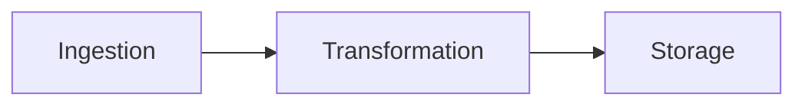
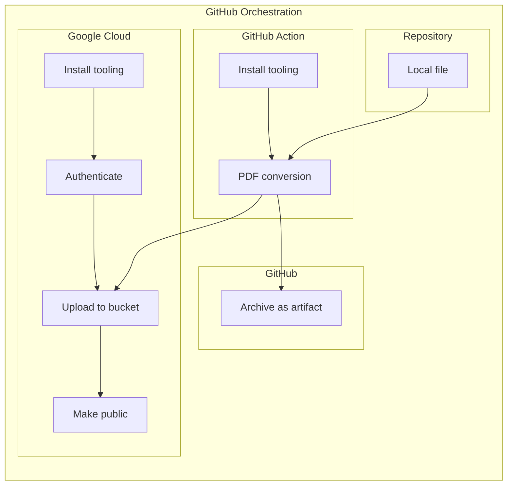

# A demo project for a cloud publishing pipeline

## Workflow

1. Ingest markdown from project repository.
2. Transform markdown to PDF.
3. Save result as a repo artifact.
4. Save result in a public Google Cloud storage bucket.

See [the pipeline steps in YAML](./.github/workflows/pipeline.yml).  
See [the published PDF conversion in GCP](https://storage.googleapis.com/github-publishing-pipeline/example.pdf).

### In pictures

This is a grossly high-level view.
With details from the GitHub workflow:

This is still a trivial pipeline but represents this demo project.

## TODO

- Containerize the build (such as with [Earthly](https://earthly.dev/))
- Transform data in a cloud function <-- Next local project work
- Ingest from a cloud bucket
- Sign docs in the buckets to build user trust
